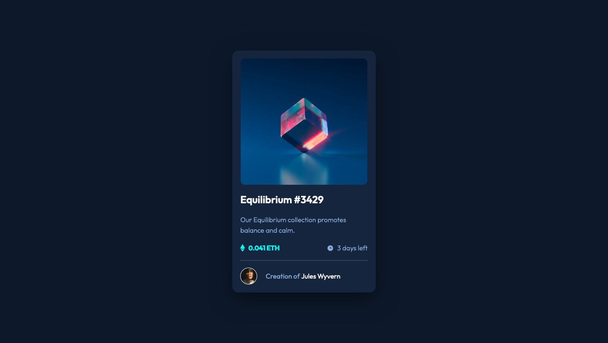

# Frontend Mentor - NFT preview card component solution

This is a solution to the [NFT preview card component challenge on Frontend Mentor](https://www.frontendmentor.io/challenges/nft-preview-card-component-SbdUL_w0U). Frontend Mentor challenges help you improve your coding skills by building realistic projects.

## Table of contents

- [Overview](#overview)
  - [The challenge](#the-challenge)
  - [Screenshot](#screenshot)
  - [Links](#links)
- [My process](#my-process)
  - [Built with](#built-with)
  - [What I learned](#what-i-learned)
  - [Continued development](#continued-development)
  - [Useful resources](#useful-resources)
- [Author](#author)

## Overview

### The challenge

Users should be able to:

- View the optimal layout depending on their device's screen size
- See hover states for interactive elements

### Screenshot



### Links

- Solution URL: [https://www.frontendmentor.io/solutions/nft-preview-card-using-html-css-and-flexbox-GeBShcdRZ](https://www.frontendmentor.io/solutions/nft-preview-card-using-html-css-and-flexbox-GeBShcdRZ)
- Live Site URL: [https://nakoyawilson.github.io/nft-preview-card-component/](https://nakoyawilson.github.io/nft-preview-card-component/)

## My process

### Built with

- HTML
- CSS
- Flexbox

### What I learned

I learned to use the adjacent sibling selector to make the view icon appear on hover.

```css
.view {
  display: none;
}
.image-container:hover .overlay + .view {
  display: block;
}
```

### Continued development

For future projects I need to focus on using more advanced CSS to create effects.

### Useful resources

- [How To Create an Overlay Image Icon](https://www.w3schools.com/howto/howto_css_image_overlay_icon.asp) - This helped me to add an overlay to the image on hover.
- [Using only CSS, show div on hover over another element](https://stackoverflow.com/questions/5210033/using-only-css-show-div-on-hover-over-another-element) - This Stack Overflow question helped me to figure out how to show the view icon on hover.

## Author

- Website - [Nakoya Wilson](https://nakoyawilson.netlify.app/)
- Frontend Mentor - [@nakoyawilson](https://www.frontendmentor.io/profile/nakoyawilson)
- Twitter - [@nakoyawilson](https://twitter.com/nakoyawilson)
- LinkedIn - [@nakoyawilson](https://www.linkedin.com/in/nakoyawilson/)
